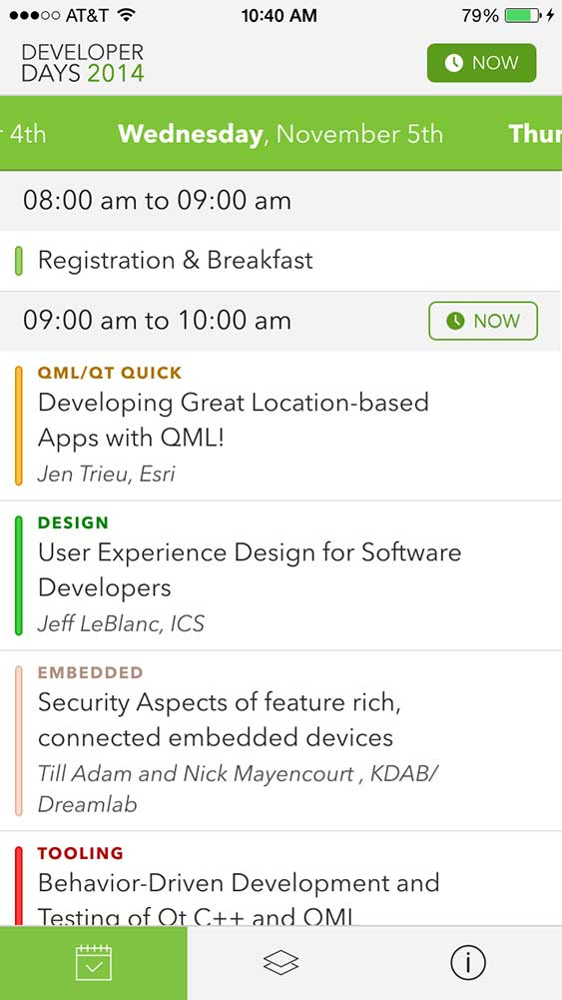

devdays14
=========

Qt Developer Days - Mobile application - Scheduling for Sessions + Tracks

- Version 1 supports both Europe / North America
- Version 2 includes more features and only supports North America

---

**Platforms:**

- iOS - [AppStore : DevDays '14](https://itunes.apple.com/us/app/devdays-14-developer-days/id922395915)
- Android - [Google Play : DevDays](https://play.google.com/store/apps/details?id=com.iktwo.qtdevdays14)
- Blackberry - If someone is interested in building this code for blackberry, feel free to pull this repo and make it work! It should run as is, with the exception of a few minor performance tweaks (if using Z10)

**Features:**

- Session Schedule
- Favorited Tracks per Session
- Detailed Track Information
- Speaker Information
- Venue information

**Design:**

[Youtube Simulation](https://www.youtube.com/watch?v=OvIy21lopsA)

---

#### Technical Details

*dev.qml*

A development window used to simulate all 4 platforms (resolutions) simultaneously.
